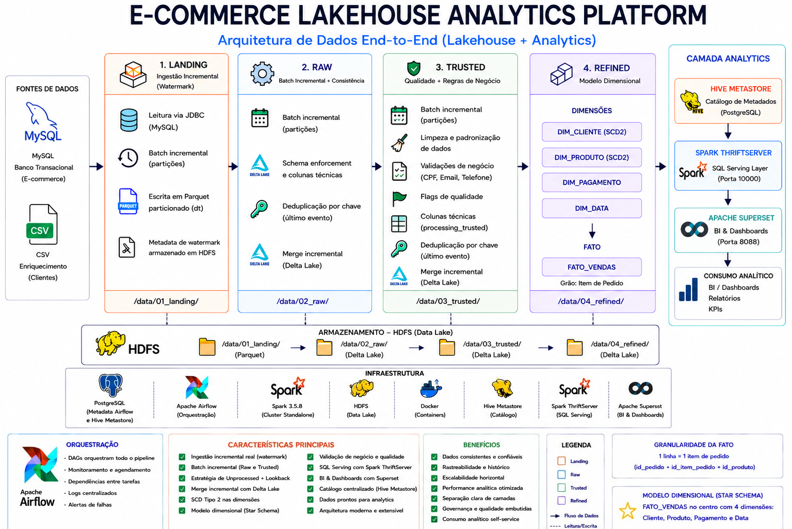
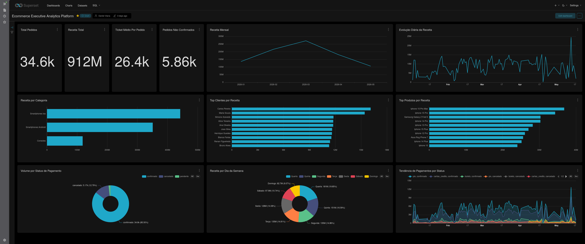
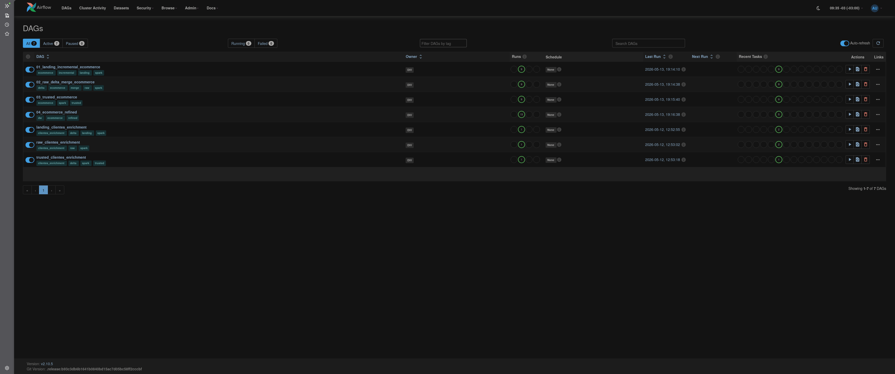
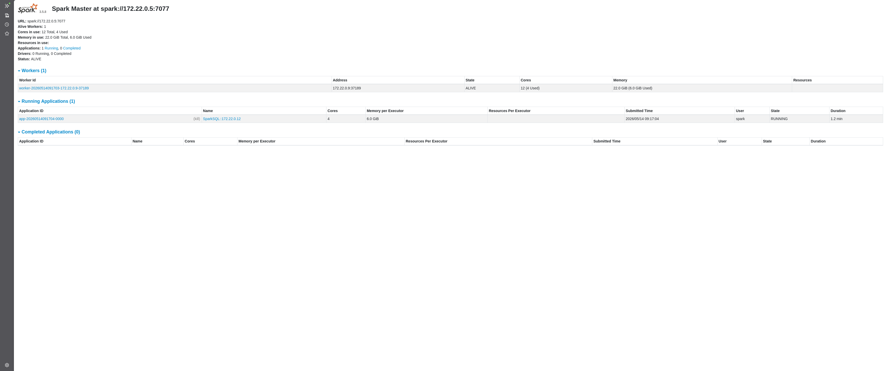
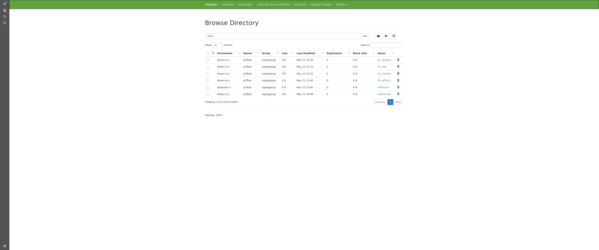

# Ecommerce Lakehouse Analytics Platform

Plataforma analítica Lakehouse end-to-end para ecommerce utilizando Medallion Architecture com Apache Spark, Delta Lake, Apache Airflow, HDFS, Hive Metastore, Spark ThriftServer e Apache Superset para processamento distribuído, SQL Serving Layer e BI analytics.

---

# 📌 Visão Geral

Este projeto implementa uma plataforma moderna de engenharia e analytics de dados voltada para processamento distribuído em larga escala.

A plataforma realiza ingestão incremental de dados transacionais de ecommerce a partir do MySQL e datasets externos de enriquecimento, processa os dados através de uma arquitetura Medallion utilizando Apache Spark e Delta Lake, disponibiliza datasets analíticos através do Hive Metastore e Spark ThriftServer, e entrega dashboards executivos utilizando Apache Superset.

Datasets auxiliares utilizados no processo de enrichment estão disponíveis em:

```text
datasets/
```

A arquitetura simula um ambiente enterprise de Lakehouse Analytics incluindo:

* Orquestração de pipelines
* Processamento distribuído
* Modelagem dimensional
* SQL serving layer
* Analytics e BI
* Governança de dados
* Data Lake distribuído

---

# 🧩 Arquitetura



---

# 🧱 Stack Tecnológica

| Tecnologia                 | Finalidade                              |
|----------------------------|------------------------------------------|
| Apache Airflow 2.10.5      | Orquestração                            |
| Apache Spark 3.5.8         | Processamento distribuído               |
| Delta Lake 3.2.0           | ACID + Merge incremental                |
| Hadoop HDFS 3.2.1          | Data Lake distribuído                   |
| Hive Metastore 4.0.0       | Catálogo centralizado                   |
| Spark ThriftServer 3.5.8   | Camada SQL                              |
| Apache Superset 6.0.1      | BI Analytics                            |
| PostgreSQL 15 (Airflow DB) | Metadata do Airflow                     |
| PostgreSQL 15 (Hive DB)    | Backend do Hive Metastore               |
| Docker Compose 5.1.3       | Infraestrutura                          |

---

# 🔄 Fluxo da Plataforma

```text
MySQL / CSV
      ↓
Landing
      ↓
Raw
      ↓
Trusted
      ↓
Refined
      ↓
Hive Metastore
      ↓
Spark ThriftServer
      ↓
Apache Superset
      ↓
Analytics Dashboards
```

---

# 🏛️ Medallion Architecture

## 🟡 Landing Layer

Camada responsável pela ingestão incremental dos dados brutos.

### Características

* Leitura JDBC
* Watermark incremental
* Persistência em parquet
* Metadata incremental no HDFS

---

## 🔵 Raw Layer

Camada responsável pela padronização e persistência incremental.

### Características

* Batch incremental por partições
* Schema enforcement
* Colunas técnicas
* Deduplicação por chave (último evento)
* Merge incremental
* Estratégia híbrida incremental (Unprocessed + Lookback)

---

## 🟢 Trusted Layer

Camada responsável pela qualidade e consistência dos dados.

### Características

* Batch incremental por partições
* Limpeza e padronização de dados
* Validações de negócio (CPF, email e telefone)
* Flags de qualidade
* Colunas técnicas
* Deduplicação por chave (último evento)
* Merge incremental

---

## 🟣 Refined Layer

Camada analítica baseada em modelagem dimensional.

### Características

* Star Schema
* Tabelas fato e dimensão
* SCD Tipo 2
* Camada semântica analítica
* Datasets otimizados para serving analítico
* Enriquecimento dimensional

---

# 📊 Camada Analytics

A plataforma implementa uma camada completa de analytics e SQL serving.

## Hive Metastore

Responsável pelo catálogo centralizado de schemas e tabelas analíticas.

---

## Spark ThriftServer

Responsável por expor consultas Spark SQL via JDBC/ODBC.

---

## Apache Superset

Responsável pela camada de visualização analítica e dashboards executivos.

---

## Analytics Engineering Layer

As queries analíticas e KPIs utilizados pelos dashboards foram organizados por domínio analítico dentro da estrutura:

```text
superset/sql/
```

A plataforma possui:

- Semantic Layer
- Executive KPIs
- Sales Analytics
- Customer Analytics
- Payment Analytics
- Product Analytics

Todas as consultas reutilizam a view analítica:

```sql
refined.vw_fato_vendas_enriquecida
```

---

## Principal View Analítica

```sql
refined.vw_fato_vendas_enriquecida
```

Essa view semântica alimenta todos os dashboards e análises do projeto.

---

# 🧠 Modelagem Dimensional

A camada Refined implementa um modelo dimensional baseado em Star Schema.


---

## Tabela Fato

### fato_vendas

Granularidade:

```text
1 linha = 1 item de pedido
```

---

## Dimensões

| Dimensão      | Estratégia |
| ------------- | ---------- |
| dim_cliente   | SCD Tipo 2 |
| dim_produto   | SCD Tipo 2 |
| dim_pagamento | Snapshot   |
| dim_data      | Calendário |

---

# 📈 Dashboards Apache Superset

## KPIs Executivos

* Receita Total
* Ticket Médio por Pedido
* Total Pedidos
* Pedidos Não Confirmados

---

## Sales Analytics

* Receita por mês
* Evolução diária da receita
* Receita por categoria
* Receita por dia da semana

---

## Customer Analytics

* Top clientes por receita

---

## Product Analytics

* Top produtos por receita

---

## Payment Analytics

* Status de pagamentos
* Tendência de pagamentos

---

# 📸 Screenshots

## Dashboard Executivo — Apache Superset



---

## Apache Airflow



---

## Apache Spark Cluster



---

## Hadoop HDFS



---

# 🚀 Execução

## Subir infraestrutura

```bash
docker compose up -d
```

---

# 🌐 Serviços

| Serviço         | URL                                            |
| --------------- | ---------------------------------------------- |
| Airflow         | [http://localhost:8080](http://localhost:8080) |
| Spark Master UI | [http://localhost:8081](http://localhost:8081) |
| HDFS Namenode   | [http://localhost:9870](http://localhost:9870) |
| Superset        | [http://localhost:8088](http://localhost:8088) |

---

# 📌 Principais Features

* Ingestão incremental via watermark
* Processamento distribuído com Spark
* Delta Lake
* Merge incremental
* Medallion Architecture
* SCD Tipo 2
* Modelagem dimensional
* Hive Metastore
* Spark SQL serving
* Dashboards executivos
* Infraestrutura dockerizada
* Arquitetura Lakehouse

---

# 📚 Documentação Técnica

| Documento                 | Descrição                           |
| ------------------------- | ----------------------------------- |
| docs/architecture.md      | Arquitetura detalhada da plataforma |
| docs/project_structure.md | Estrutura e organização do projeto  |
| docs/decisions.md         | ADRs e decisões arquiteturais       |
| superset/sql/README.md    | Camada Analytics Engineering        |

---

# 📊 Documentação dos Dashboards

A documentação analítica detalhada dos dashboards Apache Superset pode ser encontrada em:

- `superset/dashboards/ecommerce/sales_analytics.md`
- `superset/dashboards/ecommerce/customer_analytics.md`
- `superset/dashboards/ecommerce/payment_analytics.md`
- `superset/dashboards/ecommerce/product_analytics.md`
- `superset/dashboards/ecommerce/executive_analytics_dashboard.md`
---
# 🎯 Objetivo

Demonstrar a construção de uma plataforma moderna de engenharia e analytics de dados próxima de ambientes reais de produção, utilizando:

* Engenharia de Dados
* Processamento Distribuído
* Data Lakehouse
* SQL Serving
* Modelagem Dimensional
* Business Intelligence
* Governança de Dados


