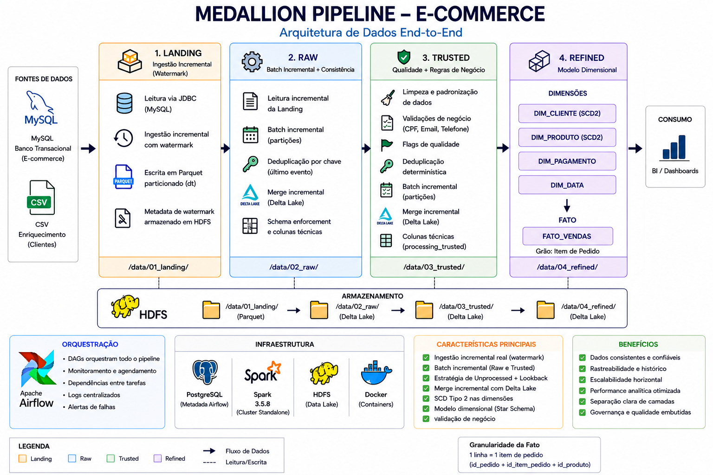

# 🏗️ Arquitetura - Medallion Pipeline E-commerce

## 📌 Visão Geral

Pipeline de dados distribuído baseado em arquitetura Medallion com modelagem dimensional na camada final.

---
## 🧩 Diagrama Arquitetura

---
## 🧱 Infraestrutura

Executado via Docker Compose:

* Airflow (Scheduler + Webserver)
* PostgreSQL (metadata)
* Spark Cluster (Master + Worker)
* HDFS (Namenode + Datanode)

---

## ⚙️ Execução

```text
Airflow DAG
   ↓
SparkSubmit
   ↓
Spark Cluster (Standalone)
   ↓
HDFS (Delta Lake)
```

---

## 🏛️ Arquitetura em Camadas

```text
Landing → Raw → Trusted → Refined
```

---

## 🟡 Landing (Ingestion Layer)

### Características:

* Ingestão incremental via watermark
* Leitura JDBC (MySQL)
* Persistência em Parquet particionado
* Metadata de controle em HDFS

### Estratégia:

```sql
WHERE data_transacao > watermark
```

---

## 🔵 Raw (Batch incremental)

### Funções:

* Padronização de schema
* Deduplicação
* CDC com Delta Lake

### Estratégias implementadas:

* Detecção de dados não processados (left anti join)
* Janela de lookback determinística (últimas partições)
* Merge incremental (upsert baseado em chave de negócio)

### Armazenamento:

* Delta Lake particionado

---

## 🟢 Trusted (Data Quality Layer)

### Funções:

* Limpeza de dados
* Validação de regras de negócio
* Padronização

### Validações:

* CPF (dígito verificador)
* Email (regex)
* Telefone

### Output:

* Dataset confiável para consumo analítico

---

## 🟣 Refined (Analytics Layer)

---
## 🧩 Modelo Dimensional (Star Schema)

---
#### Dimensões:

* dim_cliente (SCD Tipo 2)
* dim_produto (SCD Tipo 2)
* dim_pagamento
* dim_data

#### Fato:

* fato_vendas

### Características:

* Surrogate keys
* Integridade referencial
* Métricas derivadas
* CDC aplicado também na camada analítica

---

## 🔁 Estratégia Incremental Global

Aplicada em todas as camadas:

* Identificação de partições novas
* Reprocessamento controlado (lookback)
* Merge incremental com Delta

---

## 📊 Data Quality

* Validação explícita em Trusted
* Integridade referencial na Refined
* Controle de duplicidade na fato
* Flags de qualidade de dados

---

## 📌 Decisões Arquiteturais

| Decisão     | Motivo                         |
| ----------- | ------------------------------ |
| Delta Lake  | suporte a merge e ACID         |
| Watermark   | ingestão incremental eficiente |
| SCD2        | rastreabilidade histórica      |
| Star Schema | performance analítica          |
| Docker      | reprodutibilidade              |

---

## 🚀 Evoluções Possíveis

- **Data Quality Framework (Great Expectations)**  
  Evolução para validações formais de qualidade de dados com data contracts, incluindo checks de schema, nullabilidade, ranges e regras de negócio nas camadas Raw e Trusted.

- **Orquestração Distribuída (Celery / Kubernetes)**  
  Escalonamento da orquestração do Apache Airflow para execução distribuída (CeleryExecutor ou KubernetesExecutor), aumentando paralelismo, resiliência e throughput dos pipelines.

- **Camada de Serving (API / BI)**  
  Exposição dos dados da camada Refined via ferramentas de BI (ex: :contentReference[oaicite:0]{index=0}) ou APIs (ex: :contentReference[oaicite:1]{index=1}), habilitando consumo por usuários finais e aplicações.

- **Observabilidade (Métricas e Logs)**  
  Implementação de monitoramento estruturado com coleta de métricas de execução (tempo, falhas, retries) e centralização de logs, possibilitando alertas e análise operacional.