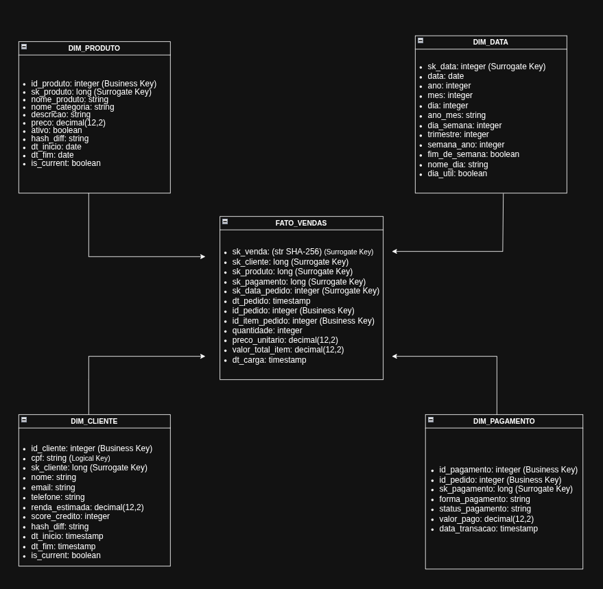

# 🏗️ Arquitetura — Ecommerce Lakehouse Analytics Platform

Documentação técnica da arquitetura de dados utilizada na plataforma Ecommerce Lakehouse Analytics Platform.

Este documento descreve as estratégias arquiteturais, processamento distribuído, incrementalidade, modelagem dimensional e serving analítico implementados na solução.

---

# 📌 Objetivos Arquiteturais

A arquitetura foi projetada para garantir:

* Escalabilidade horizontal
* Processamento incremental eficiente
* Governança de dados
* Reprocessamento controlado
* Consistência analítica
* SQL serving distribuído
* Separação entre storage e compute

---

# 🧩 Arquitetura Geral


---

# 📥 Estratégia de Ingestão

A camada de ingestão é responsável pela captura incremental de dados transacionais e datasets auxiliares.

---

## Fontes de Dados

### MySQL

* Base transacional de ecommerce
* Ingestão incremental via JDBC

### CSV

* Dados auxiliares
* Enriquecimento dimensional
* Ingestão batch

---

## Estratégia Incremental

A ingestão incremental utiliza controle baseado em watermark.

```sql
WHERE data_transacao > watermark
```

---

## Objetivos da Estratégia

* Reduzir volume de leitura
* Minimizar reprocessamentos
* Melhorar performance operacional
* Garantir eficiência incremental

---

# 🔄 Estratégia de Processamento Incremental

A plataforma implementa estratégia híbrida incremental nas camadas Raw e Trusted.

---

## Estratégias Utilizadas

* Unprocessed
* Lookback
* Delta Merge

---

## Objetivos

* Garantir idempotência
* Tratar late arriving data
* Permitir reprocessamento controlado
* Manter consistência incremental

---

## Estratégia Delta Merge

O processamento incremental utiliza operações de merge para atualização e inserção incremental de registros.

---

# 🧱 Arquitetura de Armazenamento

A plataforma utiliza HDFS como camada de armazenamento distribuído e Delta Lake como camada transacional.

---

## Estratégia de Storage

### HDFS

Responsável por:

* Persistência distribuída
* Armazenamento das camadas do Data Lake
* Escalabilidade horizontal

---

### Delta Lake

Responsável por:

* ACID transactions
* Merge incremental
* Schema enforcement
* Controle transacional
* Time travel

---

## Estrutura do Data Lake

```text
/data/
├── 01_landing/
├── 02_raw/
├── 03_trusted/
└── 04_refined/
```

---

## Estratégia de Particionamento

Particionamento baseado em data:

```text
dt=YYYY-MM-DD
```

---

## Benefícios

* Partition pruning
* Melhor performance
* Redução de I/O
* Eficiência incremental

---

# ⚡ Arquitetura de Processamento Distribuído

O processamento distribuído é realizado utilizando Apache Spark em modo Standalone Cluster.

---

## Fluxo de Execução

```text
Airflow DAG
    ↓
SparkSubmitOperator
    ↓
Spark Driver
    ↓
Spark Master
    ↓
Spark Executors
    ↓
PySpark Processing
    ↓
Delta Lake / HDFS
```

---

## Componentes de Execução

### Spark Driver

Responsável por:

* Coordenação do job
* Planejamento de execução
* Distribuição de tarefas

---

### Spark Master

Responsável por:

* Gerenciamento do cluster
* Alocação de recursos
* Coordenação dos executores

---

### Spark Executors

Responsáveis por:

* Execução distribuída
* Processamento paralelo
* Persistência de resultados

---

# 🧠 Estratégia de Modelagem Dimensional

A camada Refined implementa modelagem dimensional baseada em Star Schema.

---

## Modelo Analítico



---

## Estratégia Utilizada

```text
Star Schema
```

---

## Tabela Fato

### fato_vendas

Granularidade:

```text
1 linha = 1 item de pedido
```

---

## Dimensões

| Dimensão      | Estratégia |
| ------------- | ---------- |
| dim_cliente   | SCD Tipo 2 |
| dim_produto   | SCD Tipo 2 |
| dim_pagamento | Snapshot   |
| dim_data      | Calendário |

---

## Estratégia SCD Tipo 2

As dimensões históricas utilizam:

* hash_diff
* dt_inicio
* dt_fim
* is_current

---

## Objetivos

* Preservação histórica
* Auditoria analítica
* Rastreabilidade temporal
* Consistência dimensional

---

# 📊 SQL Serving & Analytics Layer

A plataforma implementa uma camada de serving analítico sobre o Lakehouse.

---

## Hive Metastore

Responsável pelo catálogo centralizado de schemas e tabelas analíticas.

---

## Spark ThriftServer

Responsável por disponibilizar consultas Spark SQL via JDBC/ODBC.

---

## Apache Superset

Responsável pela visualização analítica e consumo de dashboards.

---

## Fluxo Analítico

```text
Refined Layer
      ↓
Hive Metastore
      ↓
Spark ThriftServer
      ↓
Apache Superset
      ↓
Executive Dashboards
```

---

# 🧠 Semantic Layer

A camada semântica é baseada em views analíticas reutilizáveis.

---

## Principal View Analítica

```sql
refined.vw_fato_vendas_enriquecida
```

---

## Objetivos

* Padronização de métricas
* Reutilização analítica
* Simplificação para BI
* Abstração da complexidade dimensional

---

# ⚙️ Orquestração

A orquestração é realizada utilizando Apache Airflow.

---

## Responsabilidades

* Agendamento de pipelines
* Dependências entre camadas
* Retry automático
* Logs centralizados
* Observabilidade operacional
* Controle de execução

---

## Estratégia Operacional

* DAGs desacopladas por camada
* SparkSubmitOperator
* Execuções incrementais
* Controle por metadata
* Reprocessamento controlado

---

# 🔍 Observabilidade

A plataforma implementa mecanismos de observabilidade operacional e monitoramento.

---

## Recursos Implementados

* Logs centralizados via Airflow
* Spark UI
* DAG monitoring
* Controle incremental por metadata
* Arquivos `_SUCCESS`
* Monitoramento operacional

---

# 📈 Estratégias de Escalabilidade

A arquitetura utiliza estratégias voltadas para eficiência operacional e escalabilidade distribuída.

---

## Estratégias Implementadas

* Processamento distribuído
* Batch incremental
* Partition pruning
* Delta Merge
* Separação entre storage e compute
* Reprocessamento controlado
* Isolamento por camadas

---

# ⚖️ Trade-offs Arquiteturais

| Escolha | Benefício | 
|---|---|
| Spark Standalone | Simplicidade operacional |
| Docker Compose | Reprodutibilidade | 
| Batch Incremental | Eficiência computacional | 
| Delta Merge | Consistência incremental | 

---

# 🎯 Considerações Finais

A arquitetura implementa padrões modernos de engenharia e analytics de dados voltados para plataformas Lakehouse distribuídas, simulando cenários próximos de ambientes reais de produção.