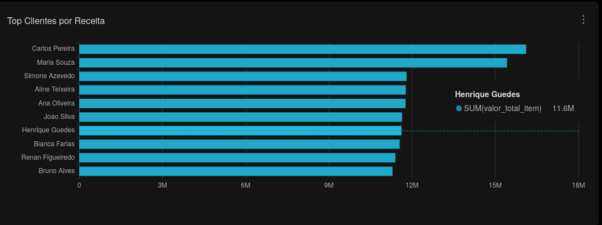

## Camada Analítica

Dataset utilizado:

```sql
refined.vw_fato_vendas_enriquecida
```

---

## Queries SQL

- `superset/sql/customer_analytics/top_clientes_receita.sql`

---

## Principais Insights

- Clientes com maior participação na receita total
- Perfil de consumo dos clientes
- Concentração de faturamento por cliente
- Participação financeira dos clientes nas vendas
- Clientes com maior relevância comercial

---

## Screenshot

### Top Clientes por Receita

