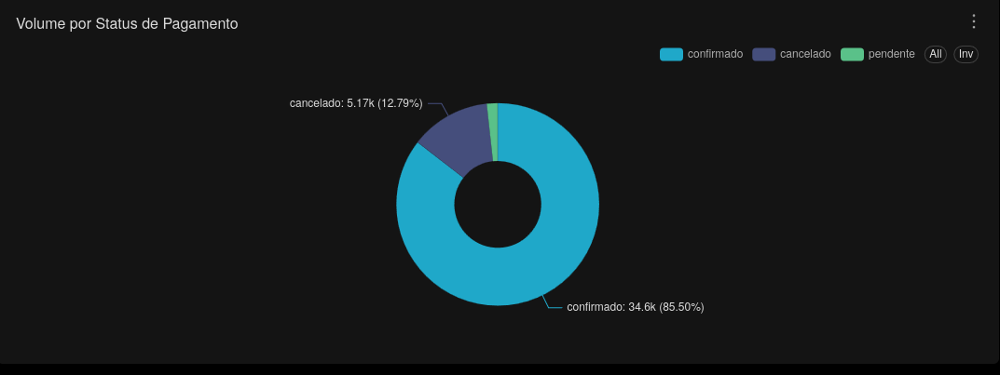
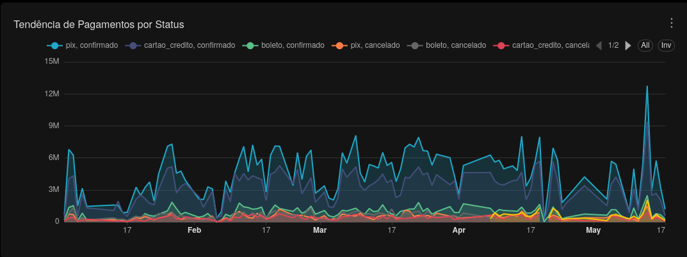

# Payment Analytics

Esta seção analítica faz parte do dashboard executivo central da plataforma analytics.

Responsável pela análise financeira e comportamento transacional dos pagamentos do ecommerce.

---

## Objetivos Analíticos

- Monitorar status de pagamentos
- Analisar comportamento por forma de pagamento
- Avaliar volume transacional
- Medir receita por meio de pagamento
- Identificar tendências financeiras ao longo do tempo

---

## KPIs e Métricas

- Quantidade de transações
- Receita por forma de pagamento
- Receita por status de pagamento
- Distribuição de pagamentos
- Tendência semanal de receita
- Participação financeira por método de pagamento

---

## Camada Analítica

Dataset utilizado:

```sql
refined.vw_fato_vendas_enriquecida
```

---

## Queries SQL

- `superset/sql/payment_analytics/volume_pedidos_status_pagamento.sql`


- `superset/sql/payment_analytics/tendencia_de_pagamentos_por_status.sql`

---

## Principais Insights

- Distribuição dos status de pagamento
- Tendências financeiras ao longo do tempo
- Participação das formas de pagamento na receita
- Comportamento transacional dos pedidos
- Eficiência operacional dos pagamentos

## Screenshot
### Volume por Status de Pagamento

### Tendência Temporal dos Pagamentos
