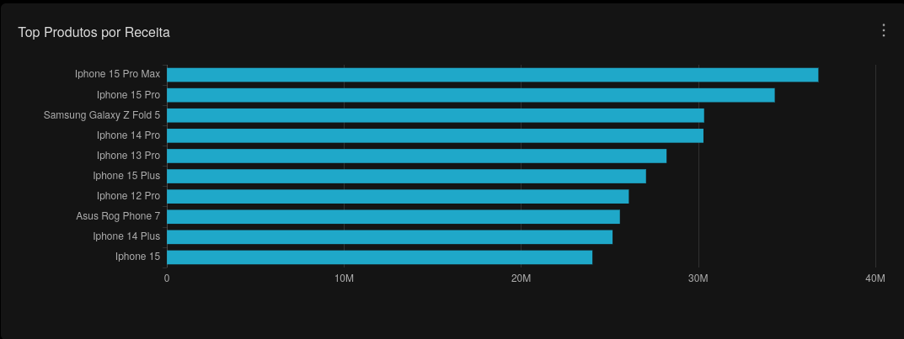

# Product Analytics

Esta seção analítica faz parte do dashboard executivo central da plataforma analytics.

Responsável pela análise de performance comercial e participação financeira dos produtos no ecommerce.

---

## Objetivos Analíticos

- Identificar produtos com maior receita
- Analisar participação comercial dos produtos
- Avaliar relevância financeira dos produtos
- Monitorar performance de vendas por produto

---

## KPIs e Métricas

- Receita por produto
- Top produtos por faturamento
- Participação financeira por produto
- Produtos com maior volume comercial

---

## Camada Analítica

Dataset utilizado:

```sql
refined.vw_fato_vendas_enriquecida
```

---

## Queries SQL

- `superset/sql/product_analytics/top_produtos_receita.sql`

---

## Principais Insights

- Produtos com maior participação na receita total
- Distribuição da receita entre produtos
- Produtos com maior relevância comercial
- Performance financeira dos produtos
- Concentração de faturamento por produto

---

## Screenshot

### Top Produtos por Receita

