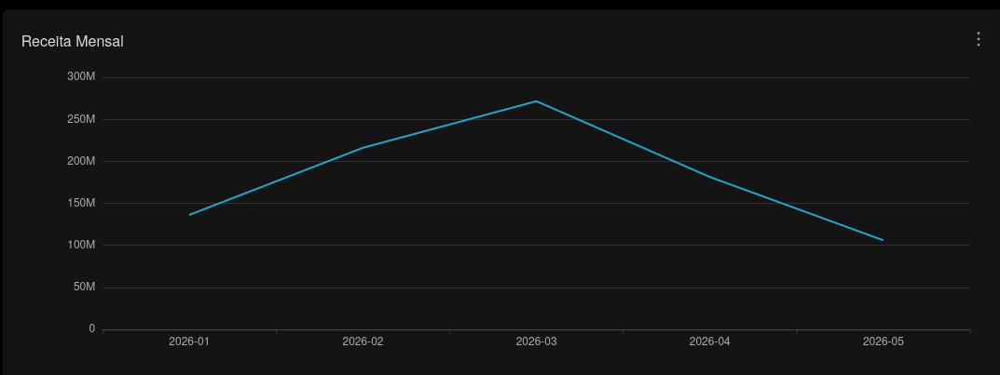
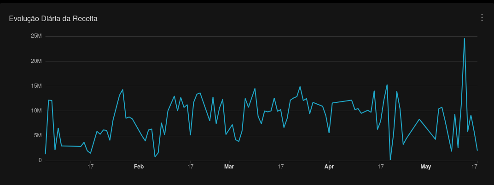
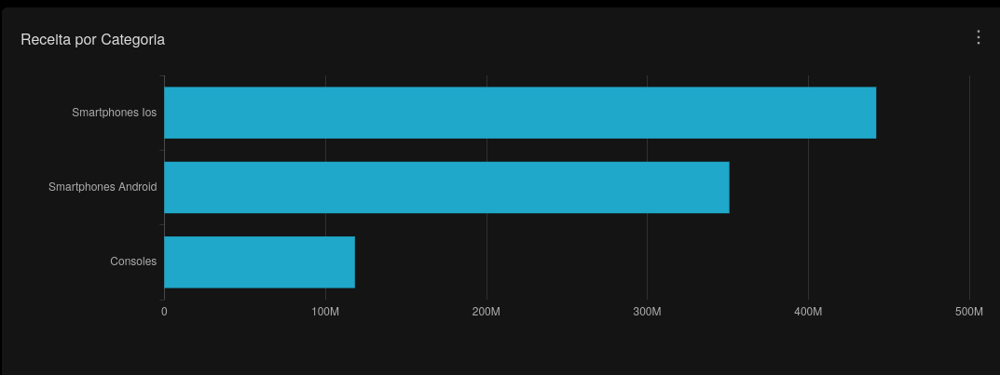
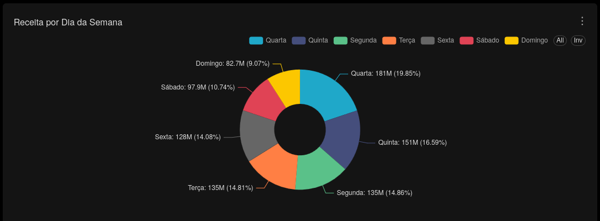

# Sales Analytics

Esta seção analítica faz parte do dashboard executivo central da plataforma analytics.

Responsável pela análise temporal de vendas, receita e comportamento comercial do ecommerce.

---

## Objetivos Analíticos

- Analisar evolução temporal das vendas
- Monitorar tendências de receita
- Avaliar volume transacional
- Identificar produtos com maior participação comercial
- Medir comportamento operacional de vendas

---

## KPIs e Métricas

- Receita mensal
- Receita por categoria
- Receita por dia da semana
- Evolução diária da receita
- Quantidade de pedidos
- Volume de itens vendidos

---

## Camada Analítica

Dataset utilizado:

```sql
refined.vw_fato_vendas_enriquecida
```

---

## Queries SQL

- `superset/sql/sales_analytics/receita_mensal.sql`
- `superset/sql/sales_analytics/evolucao_diaria_receita.sql`
- `superset/sql/sales_analytics/receita_por_categoria.sql`
- `superset/sql/sales_analytics/receita_por_dia_semana.sql`

---

## Principais Insights

- Evolução temporal da receita
- Tendências comerciais ao longo do tempo
- Categorias com maior participação financeira
- Comportamento de vendas por dia da semana
- Volume operacional de vendas
- Distribuição da receita ao longo do período analisado

---

## Screenshot

### Receita Mensal



### Evolução Diária da Receita



### Receita por Categoria



### Receita por Dia da Semana

